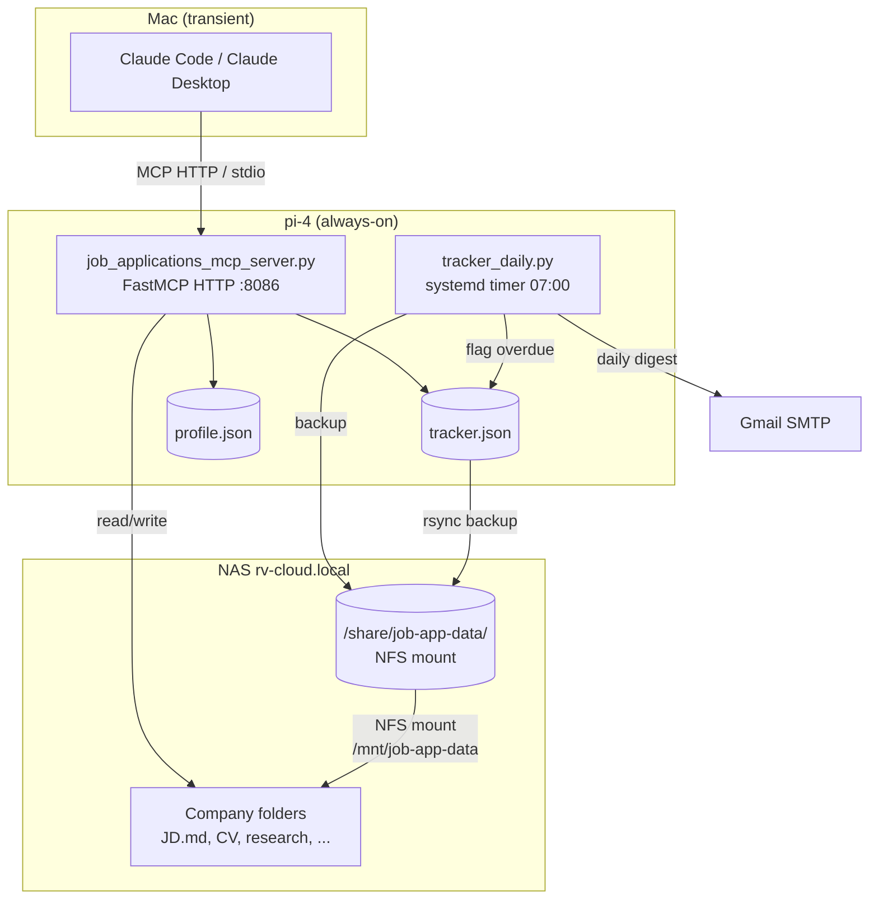
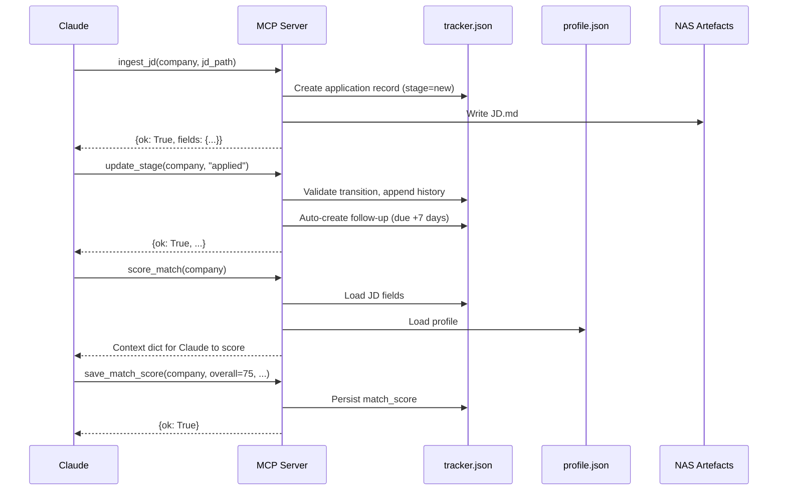

# Architecture — Job Applications MCP Server

## System Overview

A single-file Python/FastMCP server that orchestrates the job-application lifecycle. Claude calls MCP tools; the pi-4 provides only this interaction layer. Structured state is canonical in NAS PostgreSQL; application artefacts and interview notes remain on the NAS filesystem.

## Canonical Storage (2026-08-21)

Production uses `JOB_APP_STORAGE_BACKEND=postgres`. The `CanonicalState` table stores the existing `tracker`, `profile`, and `cv_records` payload shapes so application stages, history, follow-ups, outputs, profile data, and CV metadata are read and written through Postgres. JSON files are migration/recovery formats only. The legacy daily JSON tracker timer is disabled on pi-4.



## Major Components

| Component | File | Responsibility |
|-----------|------|----------------|
| MCP Server | `job_applications_mcp_server.py` | 24 tools, startup validation, state I/O |
| Daily Tracker | `tracker_daily.py` | Overdue follow-ups, email digest, NAS backup |
| Tests | `test_mcp_server.py`, `test_tracker_daily.py` | 22 test classes, path isolation via conftest |
| Systemd Units | `deploy/pi-4/*.service`, `*.timer` | Always-on service + daily timer |

## MCP Tool Groups

### Application Lifecycle
`ingest_jd`, `create_application`, `get_application_status`, `update_stage`, `list_applications`

### Follow-up Management
`get_due_followups`, `mark_followup_complete`

### Candidate Profile
`update_profile`, `refresh_profile_from_linkedin`, `get_profile_summary`

### Intelligence (context-prep pattern)
`score_match` → `save_match_score` → `analyse_gaps` → `save_gap_analysis` → `generate_learning_program` → `save_learning_program`

### Document Generation (context-prep pattern)
`tailor_cv` → `save_tailored_cv`, `generate_cover_letter` → `save_cover_letter`, `generate_pitch` → `save_pitch`

### Research
`company_research` → `save_research`, `map_territory` → `save_territory_map`

### Interview Notes
`save_interview_notes` (append-style, timestamped headings)

### Submission Tracking
`mark_submitted` (copies CV/cover letter to `submitted/` folder, records in tracker)

### Export
`export_document` (PDF via weasyprint, DOCX via python-docx)

## Data Model

### tracker.json

```json
{
  "schema_version": "1.0",
  "applications": [{
    "id": "uuid4",
    "company": "Gartner",
    "role_title": "Strategic Account Executive - Large Accounts",
    "role_slug": "strategic-account-executive-large-accounts",
    "date_created": "2026-05-28T23:17:00Z",
    "stage": "applied",
    "jd_path": "/mnt/job-app-data/Gartner/JD.md",
    "jd_source_url": "https://jobs.gartner.com/...",
    "match_score": { "overall": 75, "sub_scores": {}, "computed_at": "..." },
    "history": [{ "stage": "new", "at": "..." }],
    "followups": [{ "id": "uuid4", "action_type": "send_follow_up_email", "due_date": "2026-06-04", "status": "cancelled" }],
    "outputs": {
      "research": [{"path": "...", "saved_at": "..."}],
      "tailored_cv": [{"path": "...", "saved_at": "..."}],
      "cover_letter": [{"path": "...", "saved_at": "...", "version": 1}],
      "match_score": [{"overall": 75, "saved_at": "..."}],
      "interview_notes": [{"path": "...", "saved_at": "...", "section": "Recruiter call"}]
    },
    "submitted": {
      "cv": {"path": "Gartner/submitted/CV_tailored.md", "submitted_at": "..."},
      "cover_letter": {"path": "Gartner/submitted/Cover_Letter.md", "submitted_at": "..."}
    }
  }]
}
```

### profile.json

```json
{
  "schema_version": "1.0",
  "headline": "...",
  "current_role": { "title": "...", "company": "..." },
  "work_experience": [{ "title": "...", "company": "...", "start": "YYYY-MM", "end": "present", "description": "...", "_source": "cv|linkedin|session" }],
  "education": [...],
  "certifications": [...],
  "skills": ["..."],
  "conflicts": [{ "field_path": "...", "linkedin_value": "...", "cv_value": "...", "flagged_at": "..." }],
  "last_updated": { "work_experience": "...", "education": "...", "skills": "..." }
}
```

### Stage Machine

```
new → applied → screening → interview_r1 → interview_r2 → interview_r3 → offer → accepted
                                                                                   → rejected
                                                                                   → withdrawn
[any non-terminal] → rejected | withdrawn
```

Terminal stages: `accepted`, `rejected`, `withdrawn`. No transitions out of terminal stages.

## Data Flow



## External Services

| Service | Host | Port | Auth | Purpose |
|---------|------|------|------|---------|
| This MCP server | pi-4 (`gs-pi-4.local`) | 8086 | Bearer token | Job application lifecycle |
| AI-Assistant MCP | pi-4 | 8081 | — | Contact lookup |
| GeBiz-Awards MCP | NAS (`rv-cloud.local`) | 8085 | Bearer token | Singapore procurement data |
| Contacts MCP | pi-3 (`gs-pi-3`) | 8001 | — | Personal contact network |
| Google Contacts MCP | pi-3 | 8002 | — | Google People API |
| SGDI MCP | pi-3 | 8003 | — | Singapore government directory |

External MCP calls are made by Claude (the AI client), not by the server directly. Tool responses include `next_steps` arrays with the exact MCP call syntax.

## Deployment Architecture

### pi-4 (Always-On Host)

- **Hardware:** Raspberry Pi 4, aarch64, 1844 MB RAM, Debian 13
- **Services:**
  - `job-applications-mcp.service` — FastMCP HTTP :8086, bearer auth, `Restart=on-failure`
  - `job-applications-tracker.timer` — Fires daily at 07:00, `Persistent=true`
  - `job-applications-tracker.service` — One-shot: flag overdue, email digest, NAS backup
- **Data paths:** All `JOB_APP_*` env vars point to `/mnt/job-app-data` (NFS mount)
- **NFS mount:** `192.168.10.109:/share/job-app-data` → `/mnt/job-app-data` (fstab, `_netdev,auto`)
- **Systemd units require NFS:** `RequiresMountsFor=/mnt/job-app-data`

### NAS (rv-cloud.local)

- **Hardware:** UGREEN NAS, x86_64 N100, 8 GB RAM, UGOS Pro
- **Role:** 24/7 artefact storage via NFS share
- **Share:** `/share/job-app-data` containing all company folders, tracker.json, profile.json

### Mac (gslee-mac, Development)

- **Role:** Client + development only. No always-on services.
- **MCP access:** Via `npx mcp-remote http://gs-pi-4.local:8086/mcp` (Claude Desktop) or HTTP directly (Claude Code)
- **Local stdio:** Can run server in `MCP_MODE=stdio` for development, pointing to NAS mount or local data

## Important Dependencies

| Package | Version | Purpose | Notes |
|---------|---------|---------|-------|
| fastmcp | >=2.0,<3 | MCP server framework | Fleet-wide pin |
| PyPDF2 | ~=3.0 | PDF text extraction | Optional; graceful degradation |
| requests | ~=2.32 | JD URL fetching | Required for URL ingestion |
| beautifulsoup4 | ~=4.12 | HTML parsing | Required for URL ingestion |
| markdown | ~=3.6 | MD→HTML conversion | Required for PDF export |
| python-docx | ~=1.1 | DOCX export | Required for DOCX export |
| weasyprint | ~=61.0 | PDF export | Not on pi-4 (Cairo deps); Mac only |
| python-dotenv | ~=1.0 | .env loading | Optional; server works without .env |

## Authentication & Security

- **MCP HTTP mode:** Bearer token via `MCP_AUTH_TOKEN`. Generate with `python3 -c "import secrets;print(secrets.token_urlsafe(32))"`.
- **Gmail SMTP:** App password in `.env` as `GMAIL_APP_PASSWORD`. File mode 600.
- **NFS:** LAN-only (192.168.10.0/24). UGREENlink off, router UPnP off.
- **Tailscale:** pi-4 at `100.119.219.90`, pi-3 at `100.111.110.67`.
- **No secrets committed.** `.env` is gitignored; `.env.example` is template-only.
