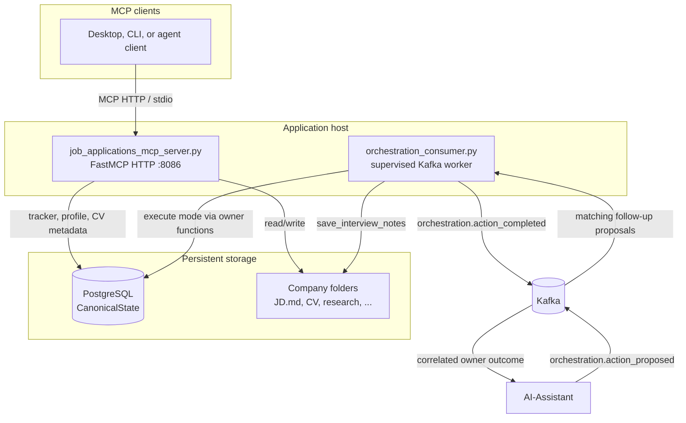
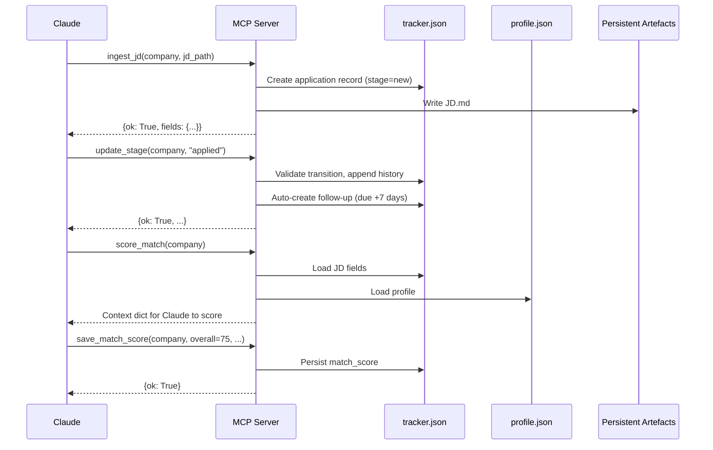

# Architecture — Job Applications MCP Server

## System Overview

A single-file Python/FastMCP server that orchestrates the job-application lifecycle. MCP clients call owner tools through stdio or HTTP. Structured state is canonical in PostgreSQL; application artefacts and interview notes remain on a deployer-configured filesystem volume.

## Canonical Storage (2026-08-21)

Production uses `JOB_APP_STORAGE_BACKEND=postgres`. The `CanonicalState` table stores the existing `tracker`, `profile`, and `cv_records` payload shapes so application stages, history, follow-ups, outputs, profile data, and CV metadata are read and written through Postgres. JSON files are migration/recovery formats only. The legacy daily JSON tracker timer should remain disabled in Postgres deployments.


```mermaid
graph TB
    subgraph "MCP clients"
        CC[Desktop, CLI, or agent client]
    end

    subgraph "Application host"
        MCP[job_applications_mcp_server.py<br/>FastMCP HTTP :8086]
        ORCH[orchestration_consumer.py<br/>supervised Kafka worker]
    end

    subgraph "Persistent storage"
        PG[(PostgreSQL<br/>CanonicalState)]
        ARTEFACTS[Company folders<br/>JD.md, CV, research, ...]
    end

    AI[AI-Assistant] -->|orchestration.action_proposed| KAFKA[(Kafka)]
    KAFKA -->|matching follow-up proposals| ORCH
    ORCH -->|orchestration.action_completed| KAFKA
    KAFKA -->|correlated owner outcome| AI
    CC -->|MCP HTTP / stdio| MCP
    MCP -->|tracker, profile, CV metadata| PG
    ORCH -->|execute mode via owner functions| PG
    MCP -->|read/write| ARTEFACTS
    ORCH -->|save_interview_notes| ARTEFACTS
```

## Major Components

| Component | File | Responsibility |
|-----------|------|----------------|
| MCP Server | `job_applications_mcp_server.py` | 24 tools, startup validation, state I/O |
| Orchestration Consumer | `orchestration_consumer.py` | Dry-run-by-default Kafka consumer for interview follow-up proposals and producer of correlated owner outcomes |
| Daily Tracker | `tracker_daily.py` | Overdue follow-ups, email digest, optional remote backup |
| Tests | `test_mcp_server.py`, `test_tracker_daily.py`, `test_orchestration_consumer.py` | Owner behavior, isolated state, and fake Kafka input |
| Systemd Units | `deploy/pi-4/*.service`, `*.timer` | Always-on MCP and orchestration services; legacy timers retained for recovery/local use |

## MCP Tool Groups

### Application Lifecycle
`ingest_jd`, `create_application`, `get_application_status`, `update_stage`, `list_applications`

### Follow-up Management
`get_due_followups`, `mark_followup_complete`

### Candidate Profile
`update_profile`, `refresh_profile_from_linkedin`, `get_profile_summary`

### Intelligence (context-prep pattern)
`score_match` → `save_match_score` → `analyse_gaps` → `save_gap_analysis` → `generate_learning_program` → `save_learning_program`

### Document Generation (context-prep pattern)
`tailor_cv` → `save_tailored_cv`, `generate_cover_letter` → `save_cover_letter`, `generate_pitch` → `save_pitch`

### Research
`company_research` → `save_research`, `map_territory` → `save_territory_map`

### Interview Notes
`save_interview_notes` (append-style, timestamped headings)

### Submission Tracking
`mark_submitted` (copies CV/cover letter to `submitted/` folder, records in tracker)

### Export
`export_document` (PDF via weasyprint, DOCX via python-docx)

## Data Model

### tracker.json

```json
{
  "schema_version": "1.1",
  "applications": [{
    "id": "uuid4",
    "company": "Example Company",
    "role_title": "Example Role",
    "role_slug": "example-role",
    "date_created": "2026-05-28T23:17:00Z",
    "stage": "applied",
    "interview_round": null,
    "jd_path": "/srv/job-applications/Example Company/JD.md",
    "jd_source_url": "https://jobs.example.com/...",
    "match_score": { "overall": 75, "sub_scores": {}, "computed_at": "..." },
    "history": [{ "stage": "new", "at": "..." }],
    "followups": [{ "id": "uuid4", "action_type": "send_follow_up_email", "due_date": "2026-06-04", "status": "cancelled" }],
    "outputs": {
      "research": [{"path": "...", "saved_at": "..."}],
      "tailored_cv": [{"path": "...", "saved_at": "..."}],
      "cover_letter": [{"path": "...", "saved_at": "...", "version": 1}],
      "match_score": [{"overall": 75, "saved_at": "..."}],
      "interview_notes": [{"path": "...", "saved_at": "...", "section": "Recruiter call"}]
    },
    "submitted": {
      "cv": {"path": "Example Company/submitted/CV_tailored.md", "submitted_at": "..."},
      "cover_letter": {"path": "Example Company/submitted/Cover_Letter.md", "submitted_at": "..."}
    }
  }]
}
```

### profile.json

```json
{
  "schema_version": "1.0",
  "headline": "...",
  "current_role": { "title": "...", "company": "..." },
  "work_experience": [{ "title": "...", "company": "...", "start": "YYYY-MM", "end": "present", "description": "...", "_source": "cv|linkedin|session" }],
  "education": [...],
  "certifications": [...],
  "skills": ["..."],
  "conflicts": [{ "field_path": "...", "linkedin_value": "...", "cv_value": "...", "flagged_at": "..." }],
  "last_updated": { "work_experience": "...", "education": "...", "skills": "..." }
}
```

### Stage Machine

```
new → applied → screening → interview_r1 → interview_r2 → ... → interview_rN → offer → accepted
                                                                                          → rejected
                                                                                          → withdrawn
[any non-terminal] → rejected | withdrawn
```

`interview_rN` accepts any positive integer (`interview_r1` through `interview_r10` and beyond). The stored `interview_round` integer is derived from the stage and backfilled for legacy records; history entries carry the same field for reporting.

Terminal stages: `accepted`, `rejected`, `withdrawn`. No transitions out of terminal stages.

## Data Flow


```mermaid
sequenceDiagram
    participant C as Claude
    participant M as MCP Server
    participant T as tracker.json
    participant P as profile.json
    participant N as Persistent Artefacts

    C->>M: ingest_jd(company, jd_path)
    M->>T: Create application record (stage=new)
    M->>N: Write JD.md
    M-->>C: {ok: True, fields: {...}}

    C->>M: update_stage(company, "applied")
    M->>T: Validate transition, append history
    M->>T: Auto-create follow-up (due +7 days)
    M-->>C: {ok: True, ...}

    C->>M: score_match(company)
    M->>T: Load JD fields
    M->>P: Load profile
    M-->>C: Context dict for Claude to score

    C->>M: save_match_score(company, overall=75, ...)
    M->>T: Persist match_score
    M-->>C: {ok: True}
```

## External Services

| Service | Host | Port | Auth | Purpose |
|---------|------|------|------|---------|
| This MCP server | Deployment-specific | 8086 | Bearer token | Job application lifecycle |
| AI-Assistant | Deployment-specific | — | Deployment-specific | Communication ingestion and orchestration proposals |
| Kafka | Deployment-specific | 9092 | Deployment-specific | Orchestration event transport |

External MCP calls are made by Claude (the AI client), not by the server directly. Tool responses include `next_steps` arrays with the exact MCP call syntax.

## Deployment Architecture

### Application host

- **Services:**
  - `job-applications-mcp.service` — FastMCP HTTP :8086, bearer auth, `Restart=on-failure`
  - `job-applications-orchestration.service` — supervised Kafka consumer, disabled/dry-run by default
  - `job-applications-tracker.timer` — legacy file-backend timer, disabled in Postgres production
- **Data paths:** `JOB_APP_*` variables point to a deployer-owned persistent volume.

### Persistent storage

- **PostgreSQL:** Canonical structured state.
- **Filesystem volume:** Company artefacts, interview notes, and submitted-document snapshots.

### Development host

- **MCP access:** Any compatible MCP HTTP client or local stdio transport.
- **Local stdio:** Run in `MCP_MODE=stdio` with the ignored `data/` directory.

## Important Dependencies

| Package | Version | Purpose | Notes |
|---------|---------|---------|-------|
| fastmcp | >=2.0,<3 | MCP server framework | Fleet-wide pin |
| PyPDF2 | ~=3.0 | PDF text extraction | Optional; graceful degradation |
| requests | ~=2.32 | JD URL fetching | Required for URL ingestion |
| beautifulsoup4 | ~=4.12 | HTML parsing | Required for URL ingestion |
| confluent-kafka | ~=2.15.0 | Kafka consumer | AI-Assistant orchestration pilot; imported lazily |
| markdown | ~=3.6 | MD→HTML conversion | Required for PDF export |
| python-docx | ~=1.1 | DOCX export | Required for DOCX export |
| weasyprint | ~=61.0 | PDF export | Requires host Cairo/Pango libraries |
| python-dotenv | ~=1.0 | .env loading | Optional; server works without .env |

## Authentication & Security

- **MCP HTTP mode:** Bearer token via `MCP_AUTH_TOKEN`. Generate with `python3 -c "import secrets;print(secrets.token_urlsafe(32))"`.
- **Gmail SMTP:** App password in `.env` as `GMAIL_APP_PASSWORD`. File mode 600.
- **Storage/network controls:** Deployment-specific; tenant data volumes should not be publicly exposed.
- **No live secrets in the release tree.** `.env` is gitignored and example
  files contain placeholders only. Historical exposure still requires rotation
  and history cleanup before public release.
